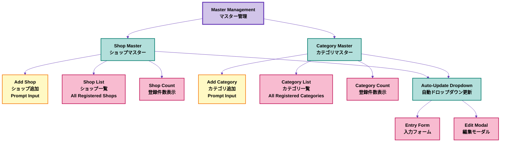
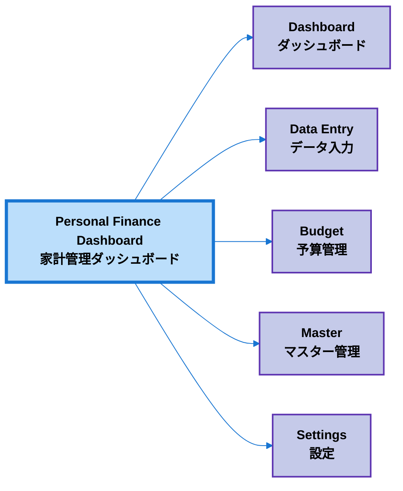
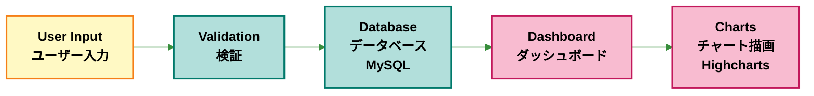

# アプリケーション画面構成図 / Application Screen Layout

このダイアグラムは、Personal Finance Dashboardの画面構成と機能配置を示しています。

This diagram shows the screen layout and feature placement of the Personal Finance Dashboard.

---

## 1. Dashboard (ダッシュボード)

ダッシュボード画面の構成と機能を示します。

```mermaid
%%{init: {'theme':'base', 'themeVariables': { 'primaryColor':'#bbdefb','primaryTextColor':'#000','primaryBorderColor':'#1976d2','lineColor':'#1976d2','secondaryColor':'#b2dfdb','tertiaryColor':'#f8bbd0','fontSize':'16px','fontFamily':'Arial'}}}%%

graph TB
    classDef mainScreen fill:#bbdefb,stroke:#1976d2,stroke-width:3px,color:#000,font-weight:bold
    classDef feature fill:#b2dfdb,stroke:#00796b,stroke-width:2px,color:#000,font-weight:bold
    classDef action fill:#fff9c4,stroke:#f57f17,stroke-width:2px,color:#000,font-weight:bold
    classDef data fill:#f8bbd0,stroke:#c2185b,stroke-width:2px,color:#000,font-weight:bold

    DASH[Dashboard<br/>ダッシュボード]:::mainScreen

    DASH --> FILTER[Period Filter<br/>期間フィルター]:::feature
    DASH --> SUMMARY[Summary Cards<br/>サマリーカード]:::feature
    DASH --> CHARTS[Charts & Graphs<br/>チャート・グラフ]:::feature
    DASH --> HISTORY[Transaction History<br/>取引履歴]:::feature
    DASH --> EXPORT[Export Data<br/>データ出力]:::action

    SUMMARY --> TOTAL[Period Total<br/>期間合計]:::data
    SUMMARY --> AVG[Daily Average<br/>1日平均]:::data
    SUMMARY --> COUNT[Record Count<br/>レコード数]:::data
    SUMMARY --> SHOPS[Shop Count<br/>ショップ数]:::data

    CHARTS --> PIE[Shop Breakdown<br/>ショップ別円グラフ]:::data
    CHARTS --> BAR[Top 10 Categories<br/>カテゴリTOP10]:::data
    CHARTS --> LINE1[Daily Trend<br/>日別推移]:::data
    CHARTS --> LINE2[Cumulative Trend<br/>累積推移]:::data
    CHARTS --> STACK[Period Analysis<br/>期間別分析<br/>12mo/2yr/5yr/10yr]:::data

    HISTORY --> TABLE[Transaction Table<br/>取引テーブル]:::data
    HISTORY --> EDIT[Edit/Delete<br/>編集・削除]:::action
    HISTORY --> SEARCH[Search & Filter<br/>検索・絞込]:::action
```

### 主な機能 / Main Features

- **期間フィルター**: 開始日・終了日を指定して表示期間を絞り込み
- **サマリーカード**: 期間合計、1日平均、レコード数、ショップ数の4種類
- **チャート**: 5種類のインタラクティブなチャート（円・棒・折れ線×2・積み上げ）
- **取引履歴**: クリック可能なフィルター機能付き取引テーブル
- **エクスポート**: CSV形式でのデータ出力

---

## 2. Data Entry (データ入力)

データ入力画面の構成と機能を示します。

```mermaid
%%{init: {'theme':'base', 'themeVariables': { 'primaryColor':'#c5cae9','primaryTextColor':'#000','primaryBorderColor':'#5e35b1','lineColor':'#5e35b1','secondaryColor':'#b2dfdb','tertiaryColor':'#f8bbd0','fontSize':'16px','fontFamily':'Arial'}}}%%

graph TB
    classDef mainScreen fill:#c5cae9,stroke:#5e35b1,stroke-width:3px,color:#000,font-weight:bold
    classDef feature fill:#b2dfdb,stroke:#00796b,stroke-width:2px,color:#000,font-weight:bold
    classDef action fill:#fff9c4,stroke:#f57f17,stroke-width:2px,color:#000,font-weight:bold
    classDef data fill:#f8bbd0,stroke:#c2185b,stroke-width:2px,color:#000,font-weight:bold

    ENTRY[Data Entry<br/>データ入力]:::mainScreen

    ENTRY --> FORM[Transaction Form<br/>取引入力フォーム]:::feature
    ENTRY --> IMPORT[CSV Import<br/>CSV一括取込]:::action
    ENTRY --> VALIDATION[Input Validation<br/>入力検証]:::feature

    FORM --> DATE[Date<br/>日付]:::data
    FORM --> AMOUNT[Amount<br/>金額<br/>Min: 1 yen]:::data
    FORM --> SHOP[Shop<br/>ショップ<br/>Dropdown with Search]:::data
    FORM --> CATEGORY[Category<br/>カテゴリ<br/>Dropdown with Search]:::data

    IMPORT --> UPLOAD[Upload CSV File<br/>CSVファイルアップロード]:::action
    IMPORT --> VALIDATE[Data Validation<br/>データ検証]:::feature
    IMPORT --> PREVIEW[Preview & Confirm<br/>プレビュー・確認]:::feature
    IMPORT --> EXECUTE[Bulk Insert<br/>一括登録]:::action

    VALIDATION --> REQUIRED[Required Fields<br/>必須項目チェック]:::data
    VALIDATION --> FORMAT[Format Check<br/>形式チェック]:::data
    VALIDATION --> RANGE[Range Check<br/>範囲チェック]:::data
```

### 主な機能 / Main Features

- **取引入力フォーム**: 日付・金額・ショップ・カテゴリの入力
- **インクリメンタル検索**: ショップ・カテゴリのドロップダウンで検索可能
- **入力検証**: リアルタイムバリデーションとエラー表示
- **CSV一括取込**: ファイルアップロードによる複数取引の一括登録
- **成功メッセージ**: 登録完了後の通知表示

---

## 3. Budget Management (予算管理)

予算管理画面の構成と機能を示します。

```mermaid
%%{init: {'theme':'base', 'themeVariables': { 'primaryColor':'#c8e6c9','primaryTextColor':'#000','primaryBorderColor':'#388e3c','lineColor':'#388e3c','secondaryColor':'#b2dfdb','tertiaryColor':'#f8bbd0','fontSize':'16px','fontFamily':'Arial'}}}%%

graph TB
    classDef mainScreen fill:#c8e6c9,stroke:#388e3c,stroke-width:3px,color:#000,font-weight:bold
    classDef feature fill:#b2dfdb,stroke:#00796b,stroke-width:2px,color:#000,font-weight:bold
    classDef action fill:#fff9c4,stroke:#f57f17,stroke-width:2px,color:#000,font-weight:bold
    classDef data fill:#f8bbd0,stroke:#c2185b,stroke-width:2px,color:#000,font-weight:bold
    classDef warning fill:#ffccbc,stroke:#e64a19,stroke-width:2px,color:#000,font-weight:bold

    BUDGET[Budget Management<br/>予算管理]:::mainScreen

    BUDGET --> BUDGETSET[Budget Setting<br/>予算設定]:::feature
    BUDGET --> PROGRESS[Progress Tracking<br/>進捗追跡]:::feature
    BUDGET --> ALERT[Budget Alerts<br/>予算アラート]:::warning
    BUDGET --> LIST[Budget List<br/>予算一覧]:::feature

    BUDGETSET --> YEAR[Target Year<br/>対象年]:::data
    BUDGETSET --> MONTH[Target Month<br/>対象月]:::data
    BUDGETSET --> AMOUNT[Budget Amount<br/>予算額]:::data
    BUDGETSET --> TYPE[Budget Type<br/>予算種別<br/>Monthly/Category/Shop]:::data

    PROGRESS --> VISUAL[Progress Bar<br/>進捗バー<br/>Color-coded]:::data
    PROGRESS --> COMPARE[Budget vs Actual<br/>予算対実績]:::data
    PROGRESS --> REMAIN[Remaining Amount<br/>残額表示]:::data
    PROGRESS --> PERCENT[Usage Percentage<br/>使用率%]:::data

    ALERT --> WARNING[80% Warning<br/>80%警告<br/>Yellow]:::warning
    ALERT --> DANGER[100% Danger<br/>100%超過<br/>Red]:::warning
    ALERT --> NOTIFY[Alert Notification<br/>アラート通知]:::warning

    LIST --> CURRENT[Current Month<br/>当月予算]:::data
    LIST --> ALL[All Budgets<br/>全予算一覧]:::data
    LIST --> DELETE[Delete Budget<br/>予算削除]:::action
```

### 主な機能 / Main Features

- **月次予算設定**: 年・月・金額を指定して予算を設定
- **視覚的進捗表示**: カラーコード付き進捗バー（緑・黄・赤）
- **予算アラート**: 80%で警告、100%で危険表示
- **予算対実績比較**: リアルタイムでの使用状況確認
- **予算一覧**: 設定済み予算の一覧表示と削除機能

---

## 4. Master Management (マスター管理)

マスター管理画面の構成と機能を示します。

### 主な機能 / Main Features

- **ショップマスター**: ショップの追加と一覧表示
- **カテゴリマスター**: カテゴリの追加と一覧表示
- **プロンプト入力**: ワンクリックで追加可能な簡単な入力方式
- **自動反映**: 新規追加後、即座にドロップダウンに反映
- **登録件数表示**: 各マスターの登録件数を表示

---

## 5. Settings (設定)

設定・共通機能を示します。

```mermaid
%%{init: {'theme':'base', 'themeVariables': { 'primaryColor':'#ffccbc','primaryTextColor':'#000','primaryBorderColor':'#ff5722','lineColor':'#ff5722','secondaryColor':'#b2dfdb','tertiaryColor':'#f8bbd0','fontSize':'16px','fontFamily':'Arial'}}}%%

graph TB
    classDef mainScreen fill:#ffccbc,stroke:#ff5722,stroke-width:3px,color:#000,font-weight:bold
    classDef feature fill:#b2dfdb,stroke:#00796b,stroke-width:2px,color:#000,font-weight:bold
    classDef action fill:#fff9c4,stroke:#f57f17,stroke-width:2px,color:#000,font-weight:bold
    classDef data fill:#f8bbd0,stroke:#c2185b,stroke-width:2px,color:#000,font-weight:bold

    SETTINGS[Settings<br/>設定・共通機能]:::mainScreen

    SETTINGS --> THEME[Theme Toggle<br/>テーマ切替]:::action
    SETTINGS --> LANG[Language Toggle<br/>言語切替]:::action
    SETTINGS --> SECURITY[Security Features<br/>セキュリティ機能]:::feature
    SETTINGS --> RESPONSIVE[Responsive Design<br/>レスポンシブデザイン]:::feature

    THEME --> DARK[Dark Mode<br/>ダークモード<br/>Black Background]:::data
    THEME --> LIGHT[Light Mode<br/>ライトモード<br/>White Background]:::data
    THEME --> CHARTTHEME[Chart Theme Sync<br/>チャート自動連動]:::feature

    LANG --> JP[Japanese<br/>日本語<br/>すべてのラベル]:::data
    LANG --> EN[English<br/>英語<br/>All Labels]:::data
    LANG --> STORAGE[LocalStorage Save<br/>選択状態保存]:::feature

    SECURITY --> CSRF[CSRF Protection<br/>CSRFトークン検証]:::feature
    SECURITY --> SANITIZE[XSS Prevention<br/>htmlspecialchars]:::feature
    SECURITY --> RATELIMIT[Rate Limiting<br/>レート制限]:::feature
    SECURITY --> SESSION[Secure Session<br/>セキュアセッション]:::feature

    RESPONSIVE --> MOBILE[Mobile View<br/>モバイル表示]:::data
    RESPONSIVE --> TABLET[Tablet View<br/>タブレット表示]:::data
    RESPONSIVE --> DESKTOP[Desktop View<br/>デスクトップ表示]:::data
    RESPONSIVE --> BOOTSTRAP[Bootstrap 5.3<br/>Grid System]:::feature
```

### 主な機能 / Main Features

- **テーマ切替**: ライト/ダークモードの切り替え（チャート自動連動）
- **言語切替**: 日本語/英語の切り替え（LocalStorageに保存）
- **セキュリティ**: CSRF保護、XSS対策、レート制限、セキュアセッション
- **レスポンシブデザイン**: モバイル・タブレット・デスクトップ対応
- **Bootstrap 5.3**: モダンなUIコンポーネント

---

## 全体構成 / Overall Structure

---

## データフロー / Data Flow

---

## 技術スタック / Technology Stack

| Category | Technology |
|----------|-----------|
| **Backend** | PHP 7.4+ with PDO |
| **Database** | MySQL 5.7+ / MariaDB 10.2+ |
| **Frontend Framework** | Bootstrap 5.3 |
| **Charts** | Highcharts |
| **Icons** | Bootstrap Icons |
| **Architecture** | MVC-inspired modular design |
| **Security** | CSRF Protection, XSS Prevention, Rate Limiting |

---

**更新日 / Last Updated**: 2025-10-25
